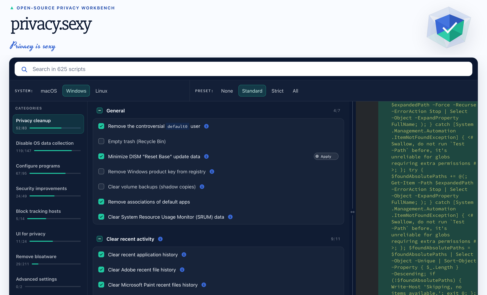

# privacy.sexy Revamped

> Free, open-source script builder that debloats and hardens Windows, macOS,
> and Linux.

privacy.sexy Revamped builds privacy and security scripts for your operating
system. Pick what you want changed: remove preinstalled Windows bloatware,
disable telemetry and tracking, or tighten macOS and Linux privacy settings.
Read the exact commands, then copy or download the script and run it yourself.

You never create an account, and no script runs until you run it.

This is an actively maintained fork of
[privacy.sexy](https://github.com/undergroundwires/privacy.sexy), updated for
current versions of Windows, macOS, and Linux.

**[Open privacy.turtlecute.org](https://privacy.turtlecute.org)**

## Why I revived this

I'm [Turtlecute](https://github.com/Turtlecute33). I'm a privacy and security
activist, and I love what privacy.sexy set out to do: make operating-system
hardening understandable, inspectable, and available to everyone.

The [original privacy.sexy project](https://github.com/undergroundwires/privacy.sexy)
was created by undergroundwires. It is now in an abandoned state, so I created
this fork to update its scripts, remove outdated or risky advice, and keep it
working as operating systems change.

I will maintain this fork and continue reviewing its scripts against current
vendor documentation. This is an independent revival and is not affiliated with
the original maintainer.

## The idea

Privacy.sexy Revamped lets you:

1. Pick your operating system and the changes you actually want.
2. Read the documentation, privacy benefit, and possible side effects.
3. Inspect the exact commands before anything runs.
4. Copy or download the generated script.
5. Run it on your computer.

There is no account or application backend. Script generation stays in your
browser, and the website does not execute system changes for you.

## What I changed

- **Web-only distribution:** I removed the abandoned Electron desktop app and
  its updater, packaging, native runtime, and release machinery. One browser
  build now works across platforms without installing the application.
- **Current Windows AI controls:** I updated the catalog for modern Windows
  policies, including Recall, Click to Do, the Microsoft Copilot app, and
  Copilot features in Edge.
- **Safer recommendations:** I removed tweaks that traded away important
  protections by disabling browser and application updates, authentication,
  recovery, antivirus integration, or other security-critical behavior.
- **Obsolete-script cleanup:** I removed legacy policy paths and retired tools
  such as `wmic`, then fixed stale commands and invalid filesystem paths across
  Windows, macOS, and Linux.
- **Safer elevated scripts:** User-scoped actions now resolve the real user's
  home directory when a script is run with elevated privileges.
- **Modern web stack:** The app now uses a leaner Vue and Vite toolchain with
  updated dependencies.
- **Regression tests:** New tests protect the web-only build,
  current Windows AI policies, and the safety boundaries of the script catalog.

## Features

- **Windows, macOS, and Linux** privacy and security tweaks in one place
- **Debloat Windows 10 and Windows 11** — remove preinstalled apps and bloatware
- **Disable telemetry and tracking**, including modern Windows AI features such
  as Recall, Click to Do, and Copilot
- **Harden macOS and Linux** privacy and security settings
- **Searchable catalog** with plain-language documentation and source links
- **Standard and strict** recommendation presets
- **Full visibility** into every generated command before you run it
- **Revert commands** for supported changes
- **Copy or download** scripts with no account and no install
- **Fully open source** — code, scripts, tests, and build process

## A note on safety

Privacy hardening changes system behavior. Read each script, understand its
warnings, keep backups, and start with the standard recommendations. A setting
that is right for one computer may break a feature another person needs.

No script can guarantee privacy, security, or anonymity. This project gives you
transparent tools and better defaults; the final decision is yours.

For vulnerabilities in the application itself, read the
[security policy](SECURITY.md).

## On AI use

I use AI assistance to develop this fork, including code, script research, and
documentation. I review what it produces before merging, checking changes against
vendor documentation and the test suite. This matters most in the script catalog,
where a wrong claim can break someone's computer.

## Credits

This project is based on
[undergroundwires/privacy.sexy](https://github.com/undergroundwires/privacy.sexy).
The original author and contributors built the foundation, application
architecture, and script library that made this revival possible.

If you want to help continue that work, bug reports, documentation fixes, script
research, and pull requests are welcome. Start with
[CONTRIBUTING.md](CONTRIBUTING.md).

## License

[GNU Affero General Public License v3.0](LICENSE), following the license of the
original project.
